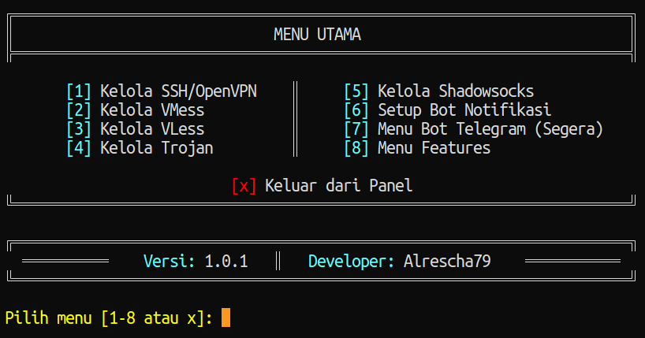

# ⚡ Installer Otomatis Panel VPN (Xray, OVPN, SSH, SlowDNS)


Script ini membantu Anda memasang layanan SSH / VPN multi-protokol (VMess, VLESS, Trojan, Shadowsocks, SlowDNS, dsb) secara otomatis disertai utilitas manajemen akun dan API sederhana.

---

## 📋 Daftar Isi

- [Persiapan](#-persiapan)
- [Instalasi](#-instalasi)
- [Setup Notifikasi Telegram](#setup-notifikasi-telegram)
- [Instalasi Bot Telegram (Opsional)](#instalasi-bot-telegram-opsional)
- [Manajemen API](#-manajemen-api)
- [Perintah Manajemen Akun](#-perintah-manajemen-akun)
- [Konfigurasi Auto Reboot](#-konfigurasi-auto-reboot)
- [Manajemen API](#-manajemen-api)
- [Perintah Manajemen Akun](#-perintah-manajemen-akun)
- [Konfigurasi Auto Reboot](#-konfigurasi-auto-reboot)
- [Setting Domain/Subdomain Support Wildcard di Cloudflare](#setting-domainsubdomain-support-wildcard-di-cloudflare)
- [Dukungan](#-dukungan)
- [Lisensi](#-lisensi)

---

## 📦 Persiapan

1. **VPS dengan Akses Root**  
   Pastikan Anda memiliki VPS dengan `akses root`. VPS harus memiliki akses `IPv4 publik`.
2. **Sistem Operasi**  
   Sistem operasi yang didukung:
   - Ubuntu 20.04, `22.04`, 24.04
   - Debian 10, `11`, 12
   - Lainnya (belum diuji, gunakan dengan risiko sendiri)
3. **Domain dan Subdomain**  
   Harus memiliki domain/subdomain yang mengarah ke `IP VPS Anda` (A record). Contoh: `vpn.example.com`
4. **Akun Cloudflare (Opsional)**  
    Jika menggunakan Cloudflare, pastikan proxy dimatikan (ikon awan abu-abu) untuk domain/subdomain yang digunakan.
5. **Akses ke Script**  
  Pastikan Anda memiliki akses ke script ini (IP dan tengggat waktu) yang didaftarkan.
  Hubungi saya di Telegram: [@Alrescha79](https://t.me/Alrescha79) untuk informasi lebih lanjut.

---

## 🚀 Instalasi

### Ganti ke User Root

```bash
sudo -i
```

atau:

```bash
sudo su
```

### Langkah 1: Jalankan Setup Script

```bash
apt-get update && \
apt-get --reinstall --fix-missing install -y whois bzip2 gzip coreutils wget screen nscd build-essential && \
wget --inet4-only --no-check-certificate -O setup.sh https://raw.githubusercontent.com/alrescha79-cmd/sc-vpn/refs/heads/main/setup.sh && \
chmod +x setup.sh && \
screen -S setup ./setup.sh
```

### ⚠️ Informasi Penting

Jika saat proses instalasi (Langkah 1) sesi terminal terputus, jangan jalankan ulang perintah instalasi dari awal. Cukup masuk kembali dan jalankan:

- Pastikan file `setup.sh` sudah tersimpan di `/root/setup.sh`.

  ```bash
  ls
  ```

- Jika ada, lanjutkan dengan menjalankan:

  ```bash
  ./setup.sh
  ```

- Masukkan `Domain/Subdomain` yang valid (A record mengarah ke IP VPS) saat diminta.
- Setelah reboot, menu utama akan otomatis muncul. Jika tidak, jalankan perintah:

  ```bash
  menu
  ```

- Jika ada masalah, silakan hubungi saya di Telegram: [@Alrescha79](https://t.me/Alrescha79)

---

## Setup Notifikasi Telegram

> [!NOTE]  
> Pastikan Anda sudah membuat bot Telegram dan mendapatkan `Token Bot` serta `Chat ID` Anda. [Cara membuat BOT Telegram dan mendapatkan Chat ID](https://gist-github-com.translate.goog/nafiesl/4ad622f344cd1dc3bb1ecbe468ff9f8a?_x_tr_sl=en&_x_tr_tl=id&_x_tr_hl=id&_x_tr_pto=tc)

Pastikan Anda berada di menu utama, jika tidak, jalankan perintah `menu`.



1. Pilih opsi `6` untuk setup notifikasi Telegram.
2. Konfirmasi dengan `y` (Yes) jika ingin melanjutkan dan `n` (No) untuk membatalkan.

3. Masukkan `Token Bot` Telegram Anda.
4. Masukkan `Chat ID` Telegram Anda.
5. Klik `Enter` untuk melanjutkan, bot akan berjalan otomatis sebagai service.

---

## Instalasi Bot Telegram (Opsional)

Jika ingin mengelola akun melalui bot Telegram, ikuti langkah berikut:

1. Instalasi Otomatis

    ```bash
    sysctl -w net.ipv6.conf.all.disable_ipv6=1 \
    && sysctl -w net.ipv6.conf.default.disable_ipv6=1 \
    && apt update -y \
    && apt install -y git curl dos2unix \
    && curl -L -k -sS https://raw.githubusercontent.com/alrescha79-cmd/sc-vpn/refs/heads/main/bot/start2 -o start2 \
    && dos2unix start2 \
    && bash start2 sellvpn \
    && [ $? -eq 0 ] && rm -f start2
    ```

2. Ikuti instruksi pada layar untuk mengonfigurasi bot Telegram Anda.
    - Masukkan `Token Bot` Telegram
    - Masukkan `Chat ID` Telegram
    - Masukkan `Group ID` Telegram (jika ada)
    - Masukkan `Nama Store` (opsional, untuk fitur pembayaran QRIS)
    - Masukkan `Data QRIS` (opsional, untuk fitur pembayaran QRIS)
    - Masukkan `Merchant ID` (opsional, untuk fitur pembayaran QRIS)
    - Masukkan `API Key` (opsional, untuk fitur pembayaran QRIS)

3. Setelah instalasi selesai, bot akan berjalan otomatis sebagai service.

### Fitur Bot Telegram

- Membuat akun baru (VMess, VLESS, Trojan, Shadowsocks, SSH)
- Memperpanjang akun yang yang sudah ada
- Menambah saldo akun pengguna (jika menggunakan sistem pembayaran)
- Melihat informasi saldo pengguna

### Tekhnologi yang Digunakan

- Node.js
- Sqlite3
- Telegraf.js

---

## 🌐 Manajemen API

Skrip menyediakan instalasi REST API (Go) untuk automasi manajemen akun.

### Instalasi API

```bash
wget https://raw.githubusercontent.com/alrescha79-cmd/sc-vpn/refs/heads/main/golang/rest-go.sh
chmod +x rest-go.sh
bash rest-go.sh
```

Setelah terpasang:

- Binary / service biasanya ditempatkan di `/usr/local/bin` atau direktori yang ditentukan skrip.
- Pastikan port API tidak diblok firewall (contoh: `ufw allow <PORT>` bila memakai UFW).
- Untuk keamanan, pasang reverse proxy + limit akses (misal iptables / fail2ban).

---

## 🧩 Perintah Manajemen Akun

Perintah-perintah berikut (di-install oleh `package-gohide.sh` atau bagian setup) tersedia di `/usr/local/bin/`:

### Pembuatan Akun

- `add-vmess` – Membuat akun VMess
- `add-vless` – Membuat akun VLESS
- `add-trojan` – Membuat akun Trojan
- `add-shadowsocks` – Membuat akun Shadowsocks
- `add-ssh` – Membuat akun SSH

### Penghapusan Akun

- `del-vmess`
- `del-vless`
- `del-trojan`
- `del-shadowsocks`
- `del-ssh`

### Pengecekan Akun

- `check-vmess`
- `check-vless`
- `check-trojan`
- `check-shadowsocks`
- `check-ssh`

### Perpanjangan Akun

- `renew-vmess`
- `renew-vless`
- `renew-trojan`
- `renew-shadowsocks`
- `renew-ssh`

> Gunakan `bash /usr/local/bin/add-vmess` (contoh) bila environment PATH bermasalah.

---

## ⏰ Konfigurasi Auto Reboot

Secara default auto reboot harian pukul 05:00. Jika ingin mengubah jadwal atau menonaktifkannya, ikuti langkah berikut:

### Menambahkan Auto Reboot menggunakan Menu

1. Pastikan Anda berada di menu utama, jika tidak, jalankan perintah `menu`.
2. Pilih opsi `8` untuk masuk ke menu pengaturan sistem.

3. Pilih `14` masuk ke menu pengaturan auto reboot.

4. Pilih `1` untuk mengubah/menambahkan jadwal auto reboot.
5. Masukkan jam dalam format 24 jam (HH:MM), contoh `02:00` untuk setiap jam 2 pagi.
6. Pilih `y` untuk menyimpan perubahan.
7. `Enter` untuk kembali ke menu pengaturan sistem.

### Menambahkan Auto Reboot menggunakan Crontab

pastikan Anda tidak berada di `menu` utama, jika tidak, jalankan perintah `Ctrl C` untuk keluar dari menu utama, lalu jalankan perintah berikut:

```bash
crontab -l > /tmp/cron.txt
sed -i "/reboot$/d" /tmp/cron.txt
echo -e "\n"'0 5 * * * '"$(which reboot)" >> /tmp/cron.txt
crontab /tmp/cron.txt
rm -rf /tmp/cron.txt
```

### Membatalkan Auto Reboot

```bash
crontab -l > /tmp/cron.txt
sed -i "/reboot$/d" /tmp/cron.txt
crontab /tmp/cron.txt
rm -rf /tmp/cron.txt
```

---

## Setting Domain/Subdomain Support Wildcard di Cloudflare

1. Masuk ke dashboard Cloudflare.
2. Pilih domain/subdomain yang digunakan.
3. Masuk ke tab `DNS`.
4. Tambahkan A record:
   - Type: `A`
   - Name: `@` (atau `*` untuk wildcard)
   - IPv4 address: `IP VPS Anda`
   - Proxy status: `DNS only` (ikon awan abu-abu)
5. Simpan perubahan.


---

## 🆘 Dukungan

Butuh bantuan / melaporkan bug:

[](https://t.me/Alrescha79)
[](mailto:anggun@cakson.my.id)

---

## 📜 Lisensi

Proyek ini dilisensikan di bawah MIT License - lihat berkas [LICENSE](./LICENSE).

Copyright © 2025 [Alrescha79](https://github.com/alrescha79-cmd)

---
