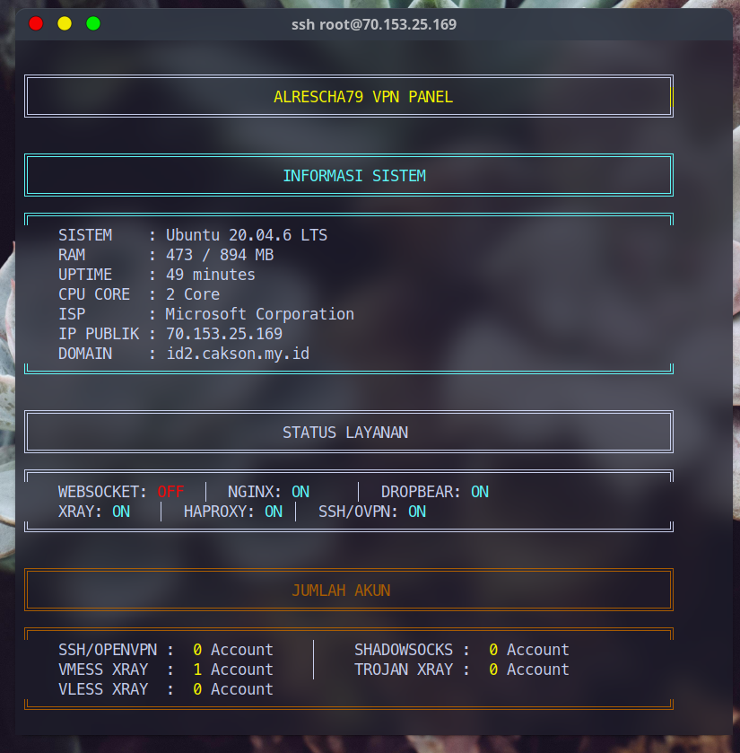
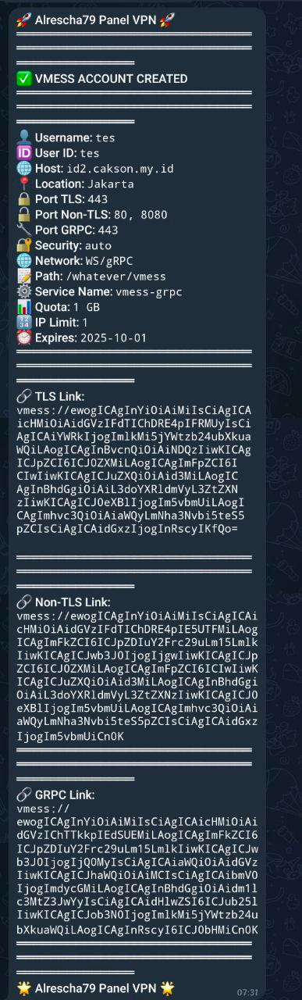

# ⚡ Panel VPN Auto Installer (Xray / OVPN / SSH / SlowDNS)


(EN) This repository provides an automated system for multi-protocol VPN/SSH account installation and management, complete with modular scripts, Go-based REST API, Telegram Bot, and account creation / checking / renewal / deletion utilities.

(ID) Repositori ini menyediakan sistem otomatis untuk instalasi & manajemen akun VPN/SSH multi-protokol, lengkap dengan skrip modular, API REST berbasis Go, Bot Telegram, serta utilitas pembuatan / pengecekan / perpanjangan / penghapusan akun.

---

> [!NOTE]  
> Untuk mendapatkan akses menggunakan skrip ini, Anda dapat mengghubungi saya di [Telegram](https://t.me/Alrescha79) untuk akses lebih lanjut.

> [!CAUTION]
> Penggunaan skrip ini untuk tujuan ilegal adalah dilarang. Penulis tidak bertanggung jawab atas penyalahgunaan yang dilakukan oleh pengguna.

> [!TIP]
> Lihat [Panduan Instalasi](./install.md) untuk instruksi lengkap.

---

## 🧭 Ringkasan (Overview)

**Tampilan Utama**  



**Contoh Notifikasi Telegram**  


**Tujuan proyek ini:**

- Mempermudah penyebaran layanan tunneling (VMess, VLESS, Trojan, Shadowsocks, SSH, dll).
- Menstandarkan perintah manajemen akun di `/usr/local/bin/`.
- Menyediakan API untuk integrasi panel eksternal / bot Telegram / dashboard.
- Meminimalkan konfigurasi manual yang rawan kesalahan.
- Membantu untuk seller VPN/SSH dalam mengelola akun pelanggan.

---

## 💻 Instalasi

Pastikan sudah berada di user `root`, lalu jalankan perintah berikut:

```bash
apt-get update && \
apt-get --reinstall --fix-missing install -y whois bzip2 gzip coreutils wget screen nscd build-essential&& \
wget --inet4-only --no-check-certificate -O setup.sh https://raw.githubusercontent.com/alrescha79-cmd/sc-vpn/refs/heads/main/setup.sh && \
chmod +x setup.sh && \
screen -S setup ./setup.sh
```

Lihat [Panduan Instalasi](./install.md) untuk instruksi lengkap.

---

## ✨ Fitur Utama

| Fitur | Deskripsi Ringkas |
|-------|-------------------|
| Multi Protokol | VMess, VLESS, Trojan, Shadowsocks, SSH (+ opsi SlowDNS / OVPN jika skrip aktif) |
| Manajemen Akun | add / del / check / renew untuk tiap protokol |
| Batas Akun | Batasi jumlah IP dan Bandwidth per protokol |
| Masa Aktif Akun | Atur masa aktif akun saat pembuatan dengan opsi perpanjangan |
| Otomatisasi | Setup otomatis Xray, SSL (via acme.sh), DNS (Cloudflare), SlowDNS (via nstx) |
| Notifikasi Telegram | Setiap kali ada perubahan akun, akun mencapai batas atau masa aktif habis |
| API Go (Opsional) | REST endpoint untuk automasi (instal via `rest-go.sh`) |
| Bot Telegram (Opsional) | Integrasi bot Telegram untuk manajemen akun dan tersedia fitur pembayaran menggunakan QRIS |
| Trial Accounts | Mendukung akun uji coba terbatas waktu |
| Auto Reboot (opsional) | Reboot VPS untuk menjaga kestabilan layanan |
| Backup / Restore | Backup data (akun, konfigurasi, dll) dan restore ketika diperlukan |
| Optimasi Kernel | Dukungan BBR & tweak jaringan (bila diaktifkan) |
| Modular | Mudah menambah protokol / handler baru |

---

## Fitur Bot Telegram (Opsional)
| Fitur | Deskripsi Ringkas |
|-------|-------------------|
| Manajemen Akun | Tambah / Hapus / Cek / Perpanjang akun via bot |
| Notifikasi | Notifikasi otomatis untuk perubahan akun, batas, dan masa aktif |
| Pembayaran QRIS | Fitur pembayaran menggunakan QRIS |
| Reseller | Fitur reseller untuk manajemen sub-akun |
| Keamanan | Autentikasi pengguna dan pembatasan akses |

---

## Fitur API Go (Opsional)

| Fitur | Deskripsi Ringkas |
|-------|-------------------|
| REST Endpoints | Tambah / Hapus / Cek / Perpanjang akun via API |
| Autentikasi | Token-based authentication untuk keamanan |
| Dokumentasi | Dokumentasi endpoint API untuk integrasi mudah |
| Logging | Log aktivitas API untuk audit dan debugging |
| Integrasi | Mudah diintegrasikan dengan panel eksternal atau bot Telegram |

## 📂 Struktur

| Path / File | Fungsi |
|-------------|--------|
| `setup.sh` | Skrip utama instalasi & orchestrator |
| `golang/rest-go.sh` | Instalasi dan setup service API Go |
| `/bot/` | Skrip bot Telegram (jika diaktifkan) |
| `package-gohide.sh` | Instalasi utilitas tambahan & symlink perintah manajemen akun |
| `install.md` | Panduan instalasi (Bahasa Indonesia) |
| `LICENSE` | Lisensi MIT |
| `README.md` | Dokumentasi utama (Bahasa Indonesia) |

---

## 🧪 Contoh Alur Kerja

1. Jalankan instalasi dasar (lihat [install.md](./install.md)).
2. Verifikasi service (misal: `systemctl status xray` atau `ss -tulpn`).
3. Masuk ke menu utama jika tidak otomatis muncul:
   ```bash
   menu
   ```
4. Tampilkan detail akun & link / JSON konfigurasi.
5. (Opsional) Instal API:
   ```bash
   bash golang/rest-go.sh
   ```
6. Integrasikan dengan panel / bot.

---

## 🛡️ Keamanan (Rekomendasi)

- Ganti port default (Xray / Trojan / Shadowsocks) bila perlu.
- Aktifkan firewall dasar (UFW / nftables).
- Batasi API hanya untuk IP tepercaya (reverse proxy + basic auth / token).
- Monitor log:
  - `/var/log/xray/`
  - Log API (cek definisi di `rest-go.sh`)

---

## 🔌 Manajemen Akun (Ringkas)

| Aksi | VMess | VLESS | Trojan | Shadowsocks | SSH |
|------|-------|-------|--------|-------------|-----|
| Tambah | `add-vmess` | `add-vless` | `add-trojan` | `add-shadowsocks` | `add-ssh` |
| Hapus | `del-vmess` | `del-vless` | `del-trojan` | `del-shadowsocks` | `del-ssh` |
| Cek | `check-vmess` | `check-vless` | `check-trojan` | `check-shadowsocks` | `check-ssh` |
| Perpanjang | `renew-vmess` | `renew-vless` | `renew-trojan` | `renew-shadowsocks` | `renew-ssh` |

---

## 📦 Sistem operasi yang didukung


### Sistem Operasi yang Direkomendasikan


#### Catatan

- Diuji pada VM `GCP (Google Cloud Platform)` dan `Microsoft Azure`.
- VPS dari penyedia lain juga didukung *(belum diuji)*, asalkan OS sesuai dan akses root tersedia.
- Mungkin berfungsi pada distro lain berbasis Debian/Ubuntu, namun tidak dijamin.

---

## ⏰ Auto Reboot

Tidak aktif default. Lihat [Konfigurasi Auto Reboot](./install.md#-konfigurasi-auto-reboot).

---

## 🆘 Dukungan

| Kanal | Link |
|-------|------|
| Telegram | [Hubungi di Telegram](https://t.me/Alrescha79) |
| Email | [Kirim Email](mailto:anggun@cakson.my.id) |

---

## 🤝 Kontribusi

1. Fork repository
2. Buat branch fitur: `git checkout -b fitur-baru`
3. Commit: `git commit -m "Tambah fitur X"`
4. Push: `git push origin fitur-baru`
5. Buka Pull Request

---

## 📜 Lisensi

MIT License – lihat [LICENSE](./LICENSE).

Copyright © 2025  
[Alrescha79](https://github.com/alrescha79-cmd)

---
